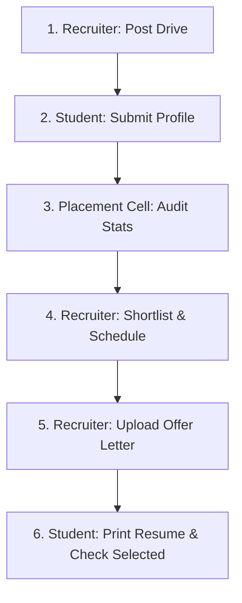

# PlacementConnect — Geeta University
### Student–Recruiter Placement Management System
**"Bridge the gap between Students and Recruiters on one smart platform"**

PlacementConnect is a modern, full-featured campus placement portal built for **Geeta University**. It digitizes the entire recruitment lifecycle — replacing manual tracking, emails, and Excel sheets with a unified, role-based platform.

---

## 🌟 Implemented Features

1. **Branded Visual System (Navy & Saffron)**
   - Custom light-mode system styled using Geeta University's official color palette: **Deep Navy Blue (`#0B3D91`)** and **Warm Gold/Saffron (`#F5A623`)**.
   - Redesigned authentication layouts with high-contrast text styling, clean slate inputs, and a segmented toggle for student roll numbers / email options.
   - Saffron Graduation Cap logo badge integrated across all panels.

2. **In-App Resume Builder (Student Portal)**
   - Live split-screen workspace displaying input fields (custom objective, contact, social links, high school scores) side-by-side with an ATS-compliant, Times New Roman A4 document template.
   - Leverages print-specific CSS media queries (`@media print`) so clicking **"Print / Save PDF"** opens a clean PDF generator directly in the browser with sidebars and action headers hidden automatically.

3. **Real-time Placement Analytics (Placement Cell Panel)**
   - Connected directly to MongoDB aggregation pipelines (`/api/analytics/placement-stats`).
   - Renders Highest, Average, and Minimum CTC package stats alongside responsive, custom SVG bar charts mapping branch placement rates and recruiter selection distributions.

4. **Applications Pipeline & Shortlist Parse**
   - Recruiter can review applicants, schedule rounds (attaching calendar `.ics` invites dispatched via Nodemailer), and upload candidate offer letters (marking them as selected).
   - Round-wise shortlist uploading via CSV files mapping roll numbers or email identifiers.

5. **GU Placement Chat (Socket.io)**
   - Real-time instant messaging workspace allowing students, recruiters, cell staff, and admins to coordinate selection rounds.

---

## 🛠️ Getting Started

### 📦 Backend Setup
1. Open a terminal in the `/backend` directory:
   ```bash
   cd backend
   npm install
   ```
2. Create or verify a `.env` file containing:
   ```env
   PORT=5000
   mongoURI=YOUR_MONGODB_ATLAS_CONNECTION_STRING
   JWT_SECRET=YOUR_JWT_SECRET_KEY
   EMAIL_USER=YOUR_NODEMAILER_SMTP_EMAIL
   EMAIL_PASS=YOUR_NODEMAILER_SMTP_PASSWORD
   CLOUDINARY_CLOUD_NAME=YOUR_CLOUDINARY_NAME
   CLOUDINARY_API_KEY=YOUR_CLOUDINARY_KEY
   CLOUDINARY_API_SECRET=YOUR_CLOUDINARY_SECRET
   ```
3. Run the database seeder to populate test profiles, active drives, and mock applications:
   ```bash
   node seed_all.js
   ```
4. Start the API server:
   ```bash
   npm start
   ```

### 💻 Frontend Setup
1. Open a terminal in the `/frontend` directory:
   ```bash
   cd frontend
   npm install
   ```
2. Start the Vite development server:
   ```bash
   npm run dev
   ```
3. Open `http://localhost:5173` in your browser.

---

## 🔑 Seeding & Test Credentials

The database seeder (`node seed_all.js`) populates the system with these pre-configured login profiles (Password is identical for all test roles):

| Role | Username / Email | Password | Details |
|---|---|---|---|
| **System Admin** | `admin@placementconnect.com` | `admin123` | Control panel, company approvals |
| **Placement Cell** | `placementcell@placementconnect.com` | `cell123` | Manage drives, CSV shortlist, audit analytics |
| **Recruiter (Google)** | `recruiter.google@placementconnect.com` | `recruiter123` | Post drives, review candidates, upload offers |
| **Student (CSE)** | `student.cse@placementconnect.com` | `student123` | CGPA: 9.2, Placed at Google |
| **Student (IT)** | `student.it@placementconnect.com` | `student123` | CGPA: 8.5, Placed at Microsoft |
| **Student (ECE)** | `student.ece@placementconnect.com` | `student123` | CGPA: 7.8, Shortlisted at TCS |

---

## 🧪 End-to-End Testing Flow

Verify the system by executing this complete recruitment lifecycle step-by-step:



### Step 1: Create a Job Posting Drive (Recruiter)
- Log in as the Google Recruiter (`recruiter.google@placementconnect.com`).
- Go to the **Post Job Drive** tab.
- Fill in: **Job Title** (e.g. Frontend Developer), **CTC Package** (e.g. 15 LPA), **Cutoff CGPA** (e.g. 8.0), and **Deadline**.
- Under **Eligibility Filters**, select **Computer Science & Engineering** and **Information Technology** and choose the **2026 Batch**.
- Click **Post Recruitment Drive**.

### Step 2: Apply for the Drive (Student)
- Log in as the CSE Student (`student.cse@placementconnect.com`).
- Go to the **Recommended Jobs** tab. You will see the newly created Google drive because CGPA (9.2) and Branch match the criteria.
- Click **View Details** and then click **Apply Now**.
- Check the **Applied Jobs** tab; the timeline status node will now display **Applied** in blue.

### Step 3: Round Selection & Shortlisting (Recruiter)
- Log back in as the Google Recruiter.
- Go to the **Applications Pipeline** tab and choose the **Frontend Developer** drive from the selector.
- You will see the CSE Student listed as **Applied**.
- Click **Shortlist**. The student's status updates to **Shortlisted**.
- Click **Schedule Interview**, input "Technical Coding Round", set a date, and click **Schedule**.
  - *Behind the scenes:* The backend automatically dispatches an email to the student with a calendar invite (`.ics` attachment).

### Step 4: Final Selection & Offer letter Upload (Recruiter)
- Go back to the **Applications Pipeline** tab in the Recruiter Dashboard.
- Under **Offer Letter**, click **Upload Offer Letter**.
- Input a document URL (e.g., a PDF URL) and click **Confirm Placement Selection**.
- The student's overall status updates to **Selected** (Green).

### Step 5: Check selection & Print Resume (Student)
- Log in as the Student.
- Observe the **My Applications** timeline; the node has advanced to **Selected** with a green checkmark.
- Click **Download Offer Letter** to retrieve the recruiter's PDF.
- Go to the **Resume Builder** tab, verify that your name, branch, and CGPA are automatically pre-populated, and click **Download / Print PDF** to generate your physical resume.

### Step 6: Verify System Analytics (Placement Cell)
- Log in as the Coordinator (`placementcell@placementconnect.com`).
- Go to **Placement Analytics**.
- Observe the **Average CTC Package** card has updated based on the new job package.
- Inspect the **Branch-wise Placement Rate** and **Company Selection Distribution** SVG bar charts to verify the Google hires are reflected in the analytics.

---

## 📽️ Presentation Demo Script (For Internship Assessment)

Use this script structure during your final presentation to showcase functionality logically and secure maximum points:

1. **Slide 1-3: Introduction & Tech Stack**
   - Introduce PlacementConnect as Geeta University's automated recruitment portal. Highlight MERN stack + Socket.io + Nodemailer integration.
2. **Phase 1: Admin & Branding Showcase**
   - Open the login page. Highlight the **custom segmented controls** (Email / Roll number toggle) and the **Saffron Graduation Cap badge**.
   - Log in as `admin@placementconnect.com`. Show the company approvals table to prove the workflow security.
3. **Phase 2: Recruiter Posting & Demographics Eligibility**
   - Log in as `recruiter.google@placementconnect.com`. Go to the job form.
   - Show how the recruiter can interactively toggle eligible branch pills and target batches (e.g. 2026 Batch) instead of hardcoded filters.
4. **Phase 3: Student Recommended Jobs & Apply**
   - Log in as `student.cse@placementconnect.com`. 
   - Point out that the Google job drive is visible because CGPA/branch checks out. Show that clicking "Apply" initiates the stepper timeline node.
5. **Phase 4: Resume Builder Print-ready Feature**
   - Go to the Student's **Resume Builder** tab.
   - Explain that data is pre-populated from the profile to save time. 
   - Click **Download / Print PDF** to trigger the print layout dialog. Show that the sidebar/navbar are hidden using print media queries.
6. **Phase 5: Shortlist Management & CSV Upload**
   - Log in as `placementcell@placementconnect.com`. Go to **CSV Shortlists**.
   - Upload a CSV containing student emails/roll numbers to demonstrate bulk parsing and automated emailing.
7. **Phase 6: Placement Analytics Dashboard**
   - Go to the **Placement Analytics** tab.
   - Show the package metrics and interactive SVG comparison charts reflecting CSE/IT hiring counts.
8. **Q&A Section**
   - Ready to explain: JWT validation middleware, MongoDB aggregations for analytics, and Socket.io signaling.

---

## 📸 Key Screenshots to Capture for Slides

Capture these screens to make your presentation slides visually stunning:

1. **Login Page**: Show the segmented toggle controls, Saffron graduation logo, and light slate contrast subtitle.
2. **Student Dashboard (Resume Builder)**: Capture the split-screen view showing the inputs on the left and the A4 Times New Roman page on the right.
3. **Student Dashboard (Applications Tab)**: Capture the timeline stepper nodes showing the transition from Applied to Shortlisted to Selected (Green).
4. **Placement Cell Dashboard (Placement Analytics)**: Capture the SVG branch bar gauges and package cards.
